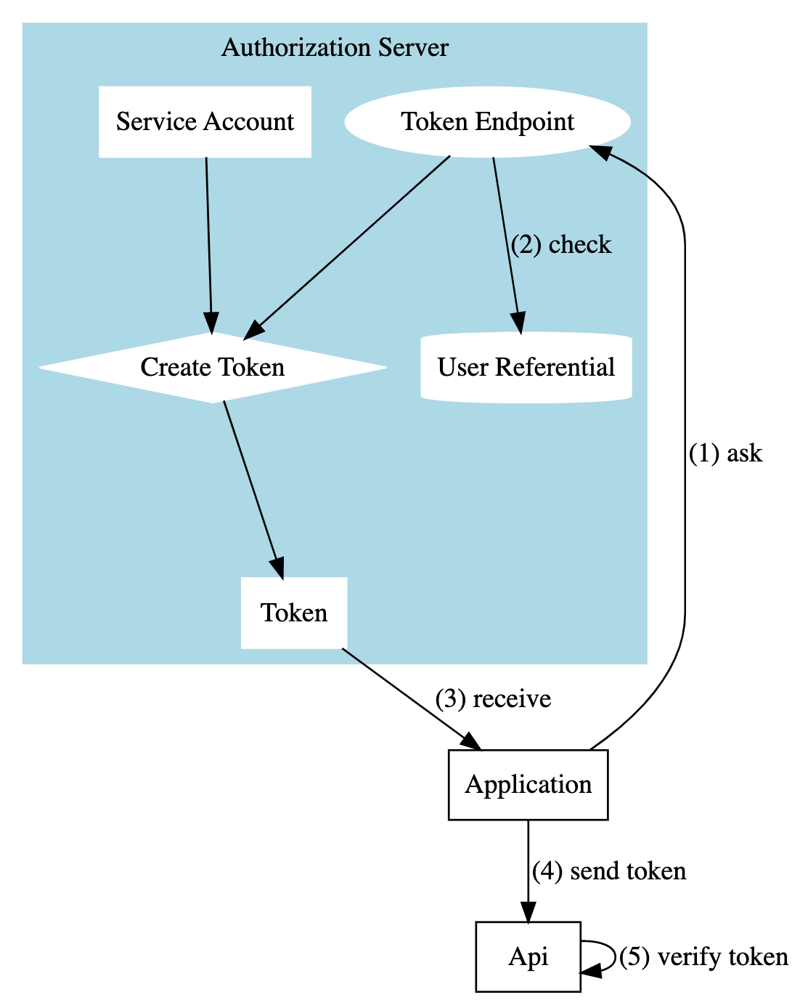

# Use a GCP Service Account as an identity provider 🆔

This project is a proof of concept demonstrating how you can use a service account as an identity provider in your stack thanks to its key (*Google-managed* and/or *User-managed*).

Here by *identity provider*, I mean a **trusted authority** which signs access tokens. 

**How does it works?**

*Note: for a complete explanation, please refer to a dedicated [article](https://medium.com/@loic.sikidi/use-a-gcp-service-account-as-an-identity-provider-c996cf717b4f) posted on Medium.*

This project is composed of 2 components:
- a simple authorization server which produces access tokens in JWT format
  - expose a single endpoint: `POST: {hostname}/token`
- a simple REST API which trusts the authorization server
  - expose a single endpoint: `GET: {hostname}/api/v1/games`

The main subtlety here is that the JWT is signed by a service account key.

*Note: both services are exposed via CloudRun*

Please find below a typical application workflow:



## Deploy the application

### Prerequisites

*Tips: if you cannot or don't want to install following tools on your machine, you can connect to your [CloudShell environment](https://shell.cloud.google.com/?show=ide%2Cterminal&cloudshell_git_repo=https://github.com/LoicSikidi/gcp-sa-as-identity-provider&cloudshell_open_in_editor=README.md&ephemeral=true). Indeed in CloudShell all required softwares are already installed!*

#### Install gcloud

- Install gcloud if it is not already installed (visit
   [GCP documentation](https://cloud.google.com/sdk/docs/install) for instructions):

#### Install Terraform

-  Install Terraform if it is not already installed (visit
   [terraform.io](https://terraform.io) for other distributions):

**You will need terraform version `>= 1.0.0`**

*Note: you can use Docker or [tfenv](https://github.com/tfutils/tfenv) to comply with this requirement*

#### Install jq

- Install jq if it is not already installed (visit
   [jq documentation](https://stedolan.github.io/jq/download/) for instructions):

#### Required IAM permissions

You will need at least the following Google-managed roles (if you are not project Owner):
- *Cloud Run Admin (roles/run.admin)*
- *Service Account Admin (roles/iam.serviceAccountAdmin)*
- *Service Usage Admin (roles/serviceusage.serviceUsageAdmin)*
- *Secret Manager Admin (roles/secretmanager.admin)*
- *Artifact Registry Administrator (roles/artifactregistry.admin)*
- *Cloud Build Editor (roles/cloudbuild.builds.editor)*

### Set up the environment

🚨 **Warning: if your project applies the following organization policies, Terraform may not work normally**

- *Domain restricted sharing: both applications will be setup to be accessible publicly (thanks to `allUsers` IAM policy) that may be forbidden*
- *Disable service account key creation: if this policy is enable Terraform won't be able to create a service account key*

1. Set the project, replace `YOUR_PROJECT` with your project ID:

```bash
PROJECT=YOUR_PROJECT
gcloud config set project ${PROJECT}
```

2. Define global variables:

```bash
REGION=europe-west1
ARTIFACT_REGISTRY=sa-as-idp
```

3. Activate required services:

```bash
gcloud services enable iam.googleapis.com
gcloud services enable iamcredentials.googleapis.com
gcloud services enable secretmanager.googleapis.com
gcloud services enable cloudbuild.googleapis.com
gcloud services enable artifactregistry.googleapis.com
gcloud services enable run.googleapis.com
```

4. Create docker registry:

```bash
gcloud artifacts repositories create $ARTIFACT_REGISTRY --location=$REGION --repository-format=docker 
```

5. Create docker images:

```bash
# build and push the authorization server
gcloud builds submit --region=$REGION --tag "$REGION-docker.pkg.dev/$PROJECT/$ARTIFACT_REGISTRY/simple-authz-server:latest" ./simple_authorization_server

# build and push the api
gcloud builds submit --region=$REGION --tag "$REGION-docker.pkg.dev/$PROJECT/$ARTIFACT_REGISTRY/simple-api:latest" ./simple_api
```

6. Configure the environment for Terraform:

```bash
[[ $CLOUD_SHELL ]] || gcloud auth application-default login
```

7. Initialize Terraform:

```bash
cd ./iac
terraform init
```

### Deployment

In order to perform tests the authorization server have 3 mocked users .

| username | password | role |
|----------|----------|------|
| alice | strongP@s$w0rd | player |
| bob | otherstrongP@s$w0rd | player |
| charlie | root | admin |

#### Option 1: Sign JWT with a Google-managed service account key (recommended)

1. Deploy the infrastructure:

```bash
terraform apply -auto-approve -var=project_id=$PROJECT -var=region=$REGION -var=registry_name=$ARTIFACT_REGISTRY
```

2. Produce an access token:

```bash
# retrieve an access token from the authorization server
ACCESS_TOKEN=$(curl -sS -X POST "$(terraform output -raw authorization_server_url)/token" -H "Content-Type: application/x-www-form-urlencoded" -d 'grant_type=password&username=alice&password=strongP@s$w0rd' | jq --raw-output .access_token)

echo $ACCESS_TOKEN
```

⚠️ *Note: If is ACCESS_TOKEN equals `null` it's because IAM permissions of the service account attached to the authorization server aren't effective yet. Wait a minute, then repeat the operation in order to get the access token.*

3. Validate the access token:

```bash
# use the access token to authenticate to the api
curl -sS -H "Authorization: Bearer $ACCESS_TOKEN" -X GET "$(terraform output -raw api_url)/api/v1/games" | jq .
```

#### Option 2: Sign JWT with a User-managed service account key (not recommended)

1. Deploy the infrastructure:

```bash
terraform apply -auto-approve -var=project_id=$PROJECT -var=region=$REGION -var=registry_name=$ARTIFACT_REGISTRY -var=use_user_managed_key=true
```

2. Produce and validate the access token:

```bash
# retrieve an access token from the authorization server
ACCESS_TOKEN=$(curl -sS -X POST "$(terraform output -raw authorization_server_url)/token" -H "Content-Type: application/x-www-form-urlencoded" -d 'grant_type=password&username=alice&password=strongP@s$w0rd' | jq --raw-output .access_token)

# use the access token to authenticate to the api
curl -sS -H "Authorization: Bearer $ACCESS_TOKEN" -X GET "$(terraform output -raw api_url)/api/v1/games" | jq .
```

### Clean up

Destroy all resources with the command below.

```bash
gcloud artifacts repositories delete $ARTIFACT_REGISTRY --location=$REGION -q
terraform destroy -auto-approve -var=project_id=$PROJECT -var=region=$REGION
```
